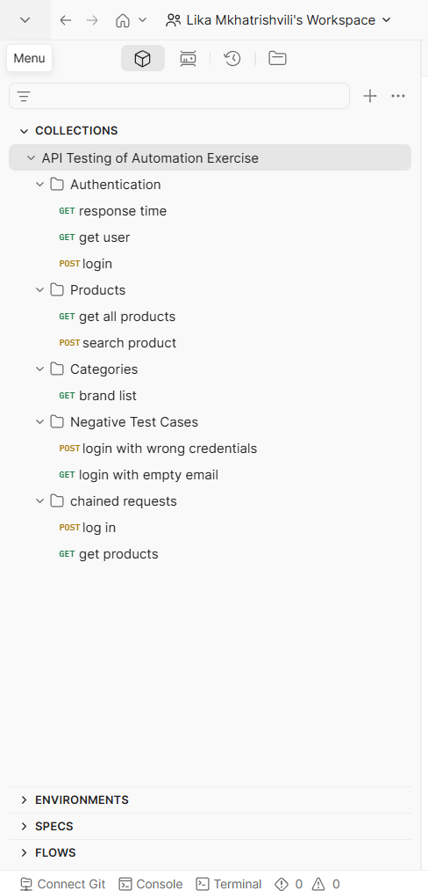
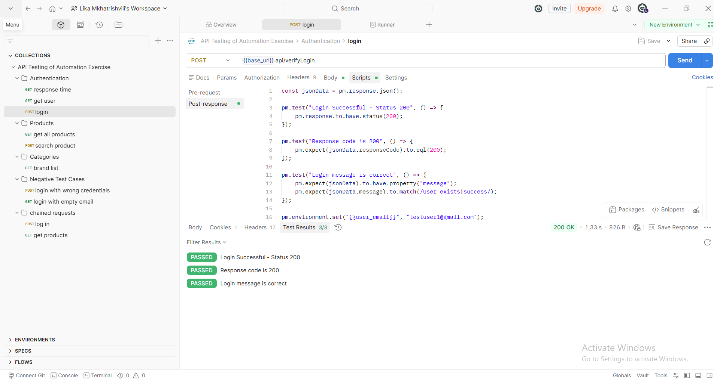
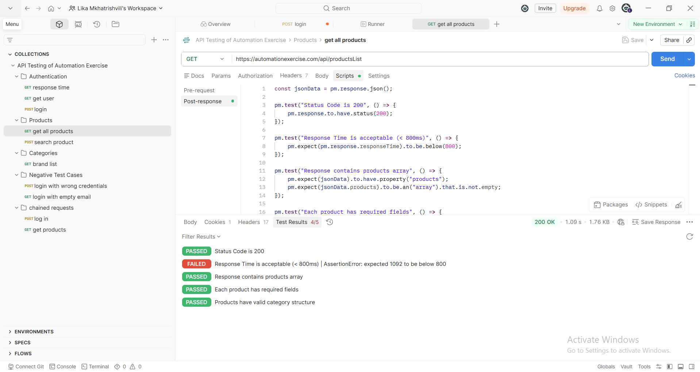
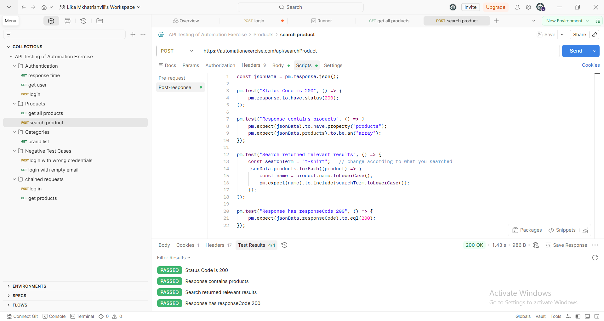

# API Testing Project - Automation Exercise (Postman)

## Project Overview
API Testing project built with Postman for practice and portfolio.

## Test Coverage
- Authentication (Login)
- Products (Get All Products + Search)
- Brands
- Negative Test Cases
- Chained Requests (End-to-End Flow)

## Tools
- Postman
- JavaScript Test Scripts
- Environment Variables

## Screenshots

## How to Run
1. Import the collection JSON file into Postman
2. Import the environment
3. Run the requests

---

This is my practice project for Junior QA / API Testing roles.
